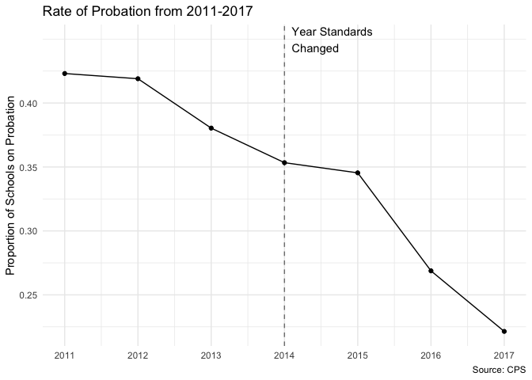

Final report
================
Jiamin
2019-03-15

    ## Parsed with column specification:
    ## cols(
    ##   .default = col_double(),
    ##   X2 = col_character(),
    ##   X3 = col_character(),
    ##   X4 = col_character(),
    ##   X5 = col_character()
    ## )

    ## See spec(...) for full column specifications.

    ## Parsed with column specification:
    ## cols(
    ##   .default = col_double(),
    ##   X2 = col_character(),
    ##   X3 = col_character(),
    ##   X4 = col_character(),
    ##   X5 = col_character()
    ## )

    ## See spec(...) for full column specifications.

### Introduction and Background

This report investigates the Chicago Public School district under Mayor
Rahm Emanuel’s term, which began in 2011. I used data publicly available
on the [CPS website](https://cps.edu/SchoolData/Pages/SchoolData.aspx),
as well as the [City of Chicago data
portal](https://data.cityofchicago.org/).

Mayor Emanuel’s term has been filled with intense debate over reforming
Chicago public schools, and was marked by events such as the 2012
Chicago Teacher’s Union strike, adoption of major reforms such as a
90-minute longer school day, and notably the largest public school
closure in history.

With these massive changes in the CPS district, I wanted to explore the
performance of elementary schools during this time, and see how CPS has
really fared under Emanuel’s term.

(Note: Throughout this report, anytime a single year is mentioned, it is
being used to refer to the beginning of the corresponding school year.
For example, the year 2017 indicates the 2017-2018 school year.)

### CPS Demographics

First, we have to understand what Chicago Public Schools are like in
terms of race and class. All of the plots that follow are made using
data from the 2017-18 school year, to see what the state of CPS is
today. We’ll use the percent of students on free and reduced lunch as a
proxy for family income levels. Students qualify for free or reduced
lunch if their families make less than 185% of the federal poverty
line.

<!-- -->

We can clearly see that the vast majority of CPS students are low
income. Now, let’s look at
race.

<!-- -->

Only 10.4% of CPS students are white. Immediately, we see that CPS
serves students that are predominately low-income minorities, a vastly
marginalized population. Now we’ll investigate where schools on
probation fall
demographically.

<!-- -->

Here we see that all of the schools that are on probation as of the
2017-18 school year are in that bottom right corner, where almost all of
the kids are low income minorities. (Take note, that bottom right
corner’s a theme.)

We’ll now see how each geographic network (how the district sorts
schools administratively - think of them as districts within the
district) looks in terms of race, income, and probation
status.

Several networks are comprised entirely of schools in the bottom right
corner - a sign of how racially- and class-segregated Chicago schools
are, even today.

### Probation Rate Over Time

We’ll start off with a simple metric and a seemingly simple question -
how has the proportion of schools on probation changed since 2011? After
all, if they are improving, we should see fewer schools on probation.
However, this question is actually not that easy to answer. For one, CPS
changed its assessment metrics beginning with the 2014-15 school year,
so probation status was conferred on totally different criteria. For
another, Rahm Emanuel closed 49 elementary schools after the 2012-2013
school year. These affect how we should interpret the change in
probation rate.

For now though, let’s take a naive approach and look at how the
proportion of schools on probation has changed from 2011 to 2017,
without taking any special
considerations.

<!-- -->

We see that it appears as though there’s been a significant and steady
decrease in the proportion of schools on probation since 2011. However,
let’s see what happens if we account for the schools that have been
closed in the period from 2011-2017. I was able to account for 66
elementary schools closing in that time, a few of which are shown below.

| School ID | School Name  | Probation Status (2011) | Rating (2011) |
| --------: | :----------- | :---------------------- | :------------ |
|    610365 | BETHUNE      | Probation               | Level 3       |
|    609888 | DODGE        | Not on Probation        | Level 2       |
|    610156 | ARMSTRONG, L | Probation               | Level 3       |
|    609906 | EMMET        | Not on Probation        | Level 2       |
|    610240 | HENSON       | Probation               | Level 3       |
|    610020 | KEY          | Probation               | Level 2       |

When we remove them outright when calculating the proportion of schools
on probation, we see the
following:

<!-- -->

Now, we can see that the probation rate did not change quite as
dramatically, although there is still a significant descrease. In fact,
any decrease in the probation rate from 2012 to 2013 was entirely due to
the schools closing - we see that the adjusted rate actually increased
slightly in that time. Additionally, of the significant improvement
still present, most of it occurred after 2014 - after the new standards
were put into place. In those four academic years, the probation rate
declined from 34.7% to 22.1%, indicating a third of the schools on
probation in the 2014-15 school year were no longer so in the 2017-18
school year.

We’ll investigate this finding later - first, let’s take a quick detour
and look more closely at those shuttered schools.

### Closed Schools - Where Were They, and What Did They Look Like?

Through some anti-joining and extra research, I was able to identify 66
schools that I could confirm had been shuttered or relocated at some
point from 2011 through 2017. The majority are schools that were closed
in the historic closures of 2013, but others were closed before or
phased out slowly after 2013.

Let’s look at what kinds of students these schools
served.

<!-- -->

There’s that bottom right corner again. The schools that were closed all
served student populations that were overwhelmingly nonwhite and
overwhelmingly qualified for free and reduced lunch - students that are
vulnerable to begin with, and may be harmed additionally by school
closings.

Now let’s see where they were geographically located, using the
geographic network structure as of 2017 to provide some organization to
the
neighborhoods.

<!-- -->

We see that school closings were clustered in what are now the 5th, 9th,
and 11th networks - neighborhoods in Chicago’s South and West Side.

  - The 5th network includes the neighborhoods of Humboldt Park, West
    Garfield Park, and Lawndale.

  - The 9th network includes the neighborhoods of Bronzeville, Hyde
    Park, and Woodlawn.

  - The 11th network includes the neighborhoods of Englewood and
    Gresham.

With the exception of Hyde Park (where UChicago is located), these are
some of the poorest neighborhoods in Chicago. Englewood has a median
income of about $22,000. You can see the median income of the other
neighborhoods using <https://richblockspoorblocks.com/>, or explore the
outcomes of children who grew up here with the [Opportunity
Atlas](https://www.opportunityatlas.org/).

### Attainment and Growth from 2014-2017

As we saw earlier, there was a major decrease in the proportion of
schools on probation from 2014 to 2017. Although there are other
factors, such as attendance and community, that go into determining a
school’s probation status, academic achievement is a major component of
CPS’s evaluation. Therefore, with this decrease in probation, we might
expect higher academic achievement in the district, especially in
struggling schools. Let’s see if this is true.

First, let’s see how the district has performed as whole, across schools
and across school years. We’ll be looking at both measures of attainment
(how much the students know right now) and growth (how much the students
learned). CPS administers the MAP test to all second to eight graders
yearly, which is how these measures are derived. Attainment is taken
from the students’ raw MAP scores placed on a national scale, while
growth is found through the administration of a pre- and post-test, of
which the difference in scores is used to measure growth.

(Note: weighted means were taken throughout this part of the analysis,
weighted by the number of
students.)

<!-- -->

Overall, we see that close to 60% of students are meeting or exceeding
the national average in attainment for reading, and 55% for math.
However, there’s quite a spread in values - with some schools at 0% (for
math) and others at 100%. Now let’s look at district-wide attainment
from
2014-2017.

<!-- -->

We see steady improvement in attainment for both math and reading in
this time period, although the rise in reading scores has stalled
recently. At first glance, the district does seem to be experiencing
improving academic achievement. Now let’s look at students’ growth,
which is an important reflection of how much the students are learning
in a school
year.

<!-- -->

Here, we see that district-wide, the average percent of students meeting
or exceeding the national average in growth is close to 60% for reading,
and 56% for math. However, especially for math, there is a large range
between
schools.

<!-- -->

Over time, we see that growth in math has experienced a slow, but steady
rise. For reading, there appears to be a sharp increase between 2014 and
2015, and a steady decrease since. I haven’t been able to determine what
caused that peak yet.

Although the district appears to be doing well overall, let’s see how
individual schools are performing with respect to attainment and growth.
Remember, we saw a sharp decrease in schools on probation, meaning
poorly-performing schools should be getting better.

(Methodological note: the following maps show the boundaries of about
350 elementary schools, meaning that the approximately 100 middle
schools that were present in the above analysis are not represented
here. However, I have found that the patterns of attainment and growth
are very similar in just elementary schools as they were in elementary
and middle
schools.)

    ## nframes and fps adjusted to match transition

<!-- -->

In the maps above, we can see that there are distinct divides in
attainment across neighborhoods, especially in math. Neighborhoods on
the North side have upwards of 70, 80, 90% of their students meeting the
national average year to year. In the South and West sides, that
percentage is more like 30 or 40%.

While we can see that overall attainment seems to have improved since
2014, that improvement is mostly present in schools that were already
doing relatively well. Many of the schools that were low-achieving in
2014 have stayed persistently so, especially in the networks we
identified earlier as being those hit by school closings.

Now we’ll look at growth across the city. CPS has recently been
celebrated for its high academic growth, as published by CEPA:
<https://cepa.stanford.edu/news/new-analysis-leading-education-expert-cps-students-are-learning-and-growing-faster-96-students-united-states>.
However, CEPA’s research looked at the district as a whole. Let’s look
at how growth varies across individual schools
now.

    ## nframes and fps adjusted to match transition

<!-- -->

We can see that there is not nearly as much disparity in growth across
neighborhoods as we saw with attainment. Especially in reading, most of
the schools across the cities have 60-70% of their students meeting the
national average in growth. Yet, in math, we see that the schools that
are lagging behind are once again concentrated in the South and West
side.

Once again, we see that growth for reading has been dipping in recent
years, indicating that CEPA’s finding about CPS (which was uncovered
using NAEP scores from 2009 to 2014) may no longer be true, or may cease
being true soon in the future.

### Conclusions

Chicago Public Schools have undergone a rocky few years recently. As
Rahm Emanuel leaves office and embarks on his national “I did a job
well-done” tour, he will (and already has) use CPS as an example of his
leadership and reform ability. However, as we have shown, the truth is a
little more complicated.

For one, Chicago schools serve almost exclusively low-income minority
kids, meaning high-income white children likely go exclusively to
private schools. Regardless, the children who do attend CPS are still
racially segregated. A white student attending a CPS school likely
attends a school in Networks 1, 2, or 4, which are also the
highest-performing schools. Issues of race, class, and educational
opportunity are compounded in Chicago, perpetuating a deep and
persistent inequality.

We see this clearly through our investigations of the school closings of
2013 and our mappings of attainment and growth across CPS schools.
Emanuel’s 2013 closures, which were supposedly motivated by
underenrollment, targeted schools almost exclusively in the same
neighborhoods on the South and West side. These schools served
vulnerable students, and the disruption of the closings actively harmed
their academic outcomes, according to a recent report by the [UChicago
Consortium](https://consortium.uchicago.edu/sites/default/files/publications/School%20Closings%20in%20Chicago-May2018-Consortium.pdf).

Furthermore, the high growth rates reported by CEPA and touted by
Emanuel are undercut by the enduring inequality seen in students’ actual
attainment level. We see that academic improvement has not reached many
schools in the South and West side, despite higher-achieving schools in
the North side making strides. Additionally, growth measured by MAP
scores, the primary indicator the district uses, have actually been
decreasing significantly in reading, a possible sign that recent
policies have not done their part to upkeep the growth seen by CEPA from
2009-2014.
